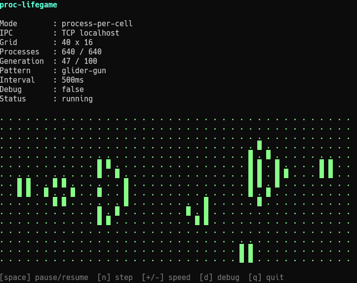
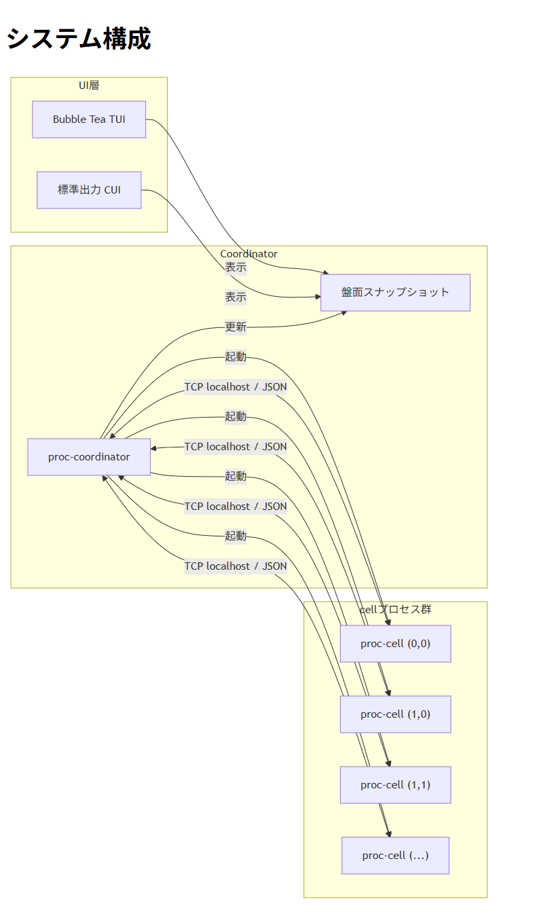
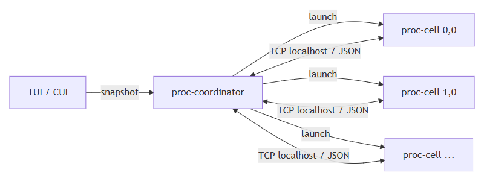
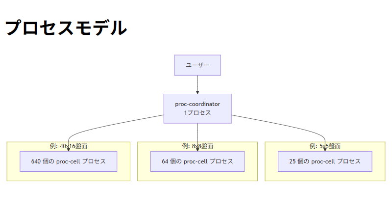
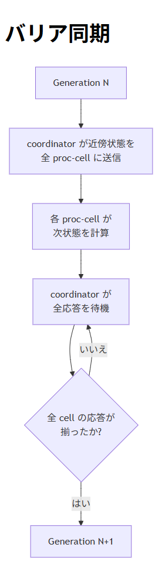
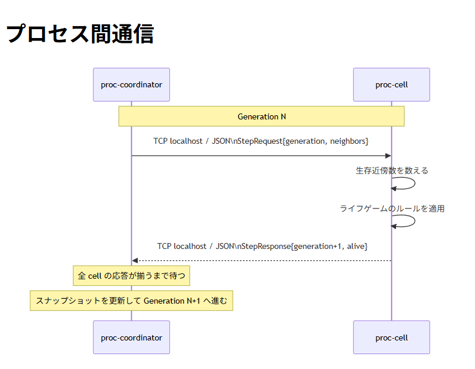

# proc-lifegame


## 概要

`proc-lifegame` は、Goで実装したLinuxプロセス版の分散ライフゲームです。  
1つのセルを1つのLinuxプロセスとして扱い、`proc-coordinator` が親プロセスとして複数の `proc-cell` を起動します。

各 `proc-cell` は自分の座標、生死状態、世代番号を保持し、`proc-coordinator` とTCP localhost + JSONで通信します。  
`coordinator` は各世代ごとに近傍状態を配布し、全セルの応答が揃ってから次の世代へ進みます。

これは効率の良いライフゲーム実装を目指したものではありません。  
目的は、プロセス管理、IPC、同期制御、Coordinator-Worker構成、TUI表示といったインフラ寄りの技術を、観察しやすい題材で学ぶことです。

## 特徴

- 1セル = 1Linuxプロセス
- TCP localhost + JSONによるプロセス間通信
- Coordinator-Worker構成
- バリア同期による世代管理
- Bubble TeaによるTUI表示
- CUIモードによる軽量表示
- 盤面サイズ・世代数・更新間隔をCLIオプションで変更可能
- ランダム配置や `glider` / `beacon` / `glider-gun` などの初期配置テンプレート

## デモ



## システム構成



`proc-coordinator` が親プロセスとして動作し、盤面サイズに応じて複数の `proc-cell` を起動します。  
各 `proc-cell` は自分の座標・生死状態・世代番号を保持し、1世代ごとに `coordinator` から近傍情報を受け取って次状態を計算します。

表示は `internal/ui` が担当しますが、UIは `cell` に直接通信しません。  
UI が見るのは、あくまで `coordinator` が生成した盤面スナップショットだけです。



## プロセスモデル



OS上では `proc-coordinator` と多数の `proc-cell` が、それぞれ独立した別プロセスとして存在します。

- `8x8` の盤面なら64個の `proc-cell` が起動します
- `5x5` の盤面なら25個の `proc-cell` が起動します
- `40x16` の盤面なら640個の `proc-cell` が起動します

この設計は効率よりも、「実際に大量のプロセスがどう管理され、どう同期されるかを観察できること」を重視しています。

## バリア同期



ライフゲームでは、全セルが同じ世代の状態をもとに次世代を計算する必要があります。  
そのため、`proc-lifegame` ではバリア同期を使っています。

流れ:

```text
Generation N
  ↓
coordinator が各 cell に近傍状態を送信
  ↓
各 cell が次状態を計算
  ↓
coordinator が全 cell の応答を待つ
  ↓
全 cell の応答が揃ったら Generation N+1 へ進む
```

この設計により、一部のセルだけが先に次世代へ進んでしまうことを防いでいます。

## プロセス間通信



通信にはTCP localhostを使い、メッセージ形式にはJSONを使っています。

- `coordinator` が各 `cell` に現在世代と近傍状態を送る
- `cell` が次世代の生死状態を返す
- 通信相手をlocalhostに閉じているため、観察しやすく、将来的なDocker化にも転用しやすい構成です

概念上の JSON メッセージ例:

```json
{
  "generation": 12,
  "neighbors": [true, false, true, false, false, true, false, false]
}
```

```json
{
  "generation": 13,
  "alive": true
}
```

実装上は、座標やメッセージタイプを含む JSON を [internal/protocol/protocol.go](internal/protocol/protocol.go) で定義しています。

## ディレクトリ構成

```text
proc-lifegame/
├── README.md
├── LICENSE
├── cmd/
│   ├── proc-coordinator/
│   └── proc-cell/
├── internal/
│   ├── grid/
│   ├── life/
│   ├── proc/
│   ├── protocol/
│   └── ui/
├── docs/
│   ├── demo.gif
│   ├── architecture.png
│   ├── barrier-sync.png
│   ├── ipc-flow.png
│   └── process-model.png
└── go.mod
```

主要ディレクトリの役割:

- `cmd/proc-coordinator`
  全体の起動、同期、スナップショット生成、UI 実行を担当します。
- `cmd/proc-cell`
  1セル1プロセスとして待ち受け、近傍状態から次状態を計算します。
- `internal/grid`
  盤面スナップショット、近傍取得、初期配置テンプレートを扱います。
- `internal/life`
  Conway's Game of Life のルール本体です。
- `internal/proc`
  子プロセスの起動、停止、補助バイナリの準備を扱います。
- `internal/protocol`
  TCP/JSON 通信で使うメッセージ型を定義します。
- `internal/ui`
  TUI/CUI 表示と表示モデルを扱います。

## 動作要件

- Go 1.24.2以上
- localhostのTCP通信が使えるLinux系環境

## 起動方法

デフォルトの表示モードは `tui` です。

```bash
go run ./cmd/proc-coordinator \
  --width 8 \
  --height 8 \
  --generations 100 \
  --pattern random \
  --interval 1s \
  --ui tui
```

CUIモードで起動する場合:

```bash
go run ./cmd/proc-coordinator \
  --width 5 \
  --height 5 \
  --generations 20 \
  --pattern glider \
  --interval 500ms \
  --ui cui
```

デバッグログを出したい場合:

```bash
go run ./cmd/proc-coordinator \
  --width 8 \
  --height 8 \
  --generations 100 \
  --pattern beacon \
  --interval 1s \
  --ui tui \
  --debug
```

## 主なオプション

- `--width`
  盤面の幅を指定します。
- `--height`
  盤面の高さを指定します。
- `--generations`
  シミュレーションする世代数を指定します。
- `--pattern`
  初期配置テンプレートを指定します。
- `--interval`
  世代更新間隔を指定します。`1s`、`500ms` などを使えます。
- `--ui`
  表示モードを指定します。`tui` または `cui` を使えます。
- `--debug`
  デバッグログを有効にします。
- `--base-port`
  `proc-cell` 用ポートの開始候補を指定します。使用中なら空いている連続ポート帯へ自動でずらします。
- `--cell-bin`
  事前ビルド済み `proc-cell` バイナリのパスです。未指定ならsiblingバイナリ、または起動時に補助バイナリを1回だけビルドして使い回します。
- `--seed`
  `--pattern random` のときに使う乱数seedです。

## 初期配置テンプレート

`--pattern` で以下のテンプレートを選べます。  
テンプレートは盤面の中央付近に配置されます。

- `random`
  ランダム配置です。
- `single`
  1つだけ生きたセルを置きます。必要サイズは `width >= 1`, `height >= 1` です。
- `block`
  `2x2`の静止形です。必要サイズは `width >= 2`, `height >= 2` です。
- `blinker`
  3セル直線の周期2振動子です。必要サイズは `width >= 3`, `height >= 1` です。
- `toad`
  6セルの周期2振動子です。必要サイズは `width >= 4`, `height >= 2` です。
- `beacon`
  2つの`2x2`ブロックによる周期2振動子です。必要サイズは `width >= 4`, `height >= 4` です。
- `glider`
  斜めに進む代表的な移動パターンです。必要サイズは `width >= 3`, `height >= 3` です。
- `lwss`
  Lightweight spaceshipです。横方向へ移動します。必要サイズは `width >= 5`, `height >= 4` です。
- `glider-gun`
  Gosper Glider Gunです。一定間隔でgliderを生成します。必要サイズは `width >= 36`, `height >= 9` です。

## TUIの操作方法

- `q`
  終了します。
- `Ctrl+C`
  終了します。
- `space`
  一時停止または再開します。
- `n`
  一時停止中に1世代だけ進めます。
- `+` または `=`
  更新を速くします。
- `-`
  更新を遅くします。

## CUIモード

CUIモードでは世代ごとにターミナルをクリアし、最新状態だけを再描画します。  
TUIより表示コストが低いため、デバッグや大きめの盤面の確認に向いています。

## ログ出力

- 通常時
  エラー以外は表示しません。
- `--debug` 指定時
  `proc-cell` の起動ログやポート自動調整ログを表示します。

## 設計上の補足

- `proc-cell` が状態の正本を持ちます。
- `proc-coordinator` は同期制御と表示用スナップショットの生成を担当します。
- UIは `coordinator` から受け取ったスナップショットだけを表示し、`cell` へ直接通信しません。
- 盤面サイズを大きくすると、起動されるプロセス数もそのまま増えます。これは効率化よりも「OS上のプロセスを観察できること」を優先した設計です。
- 通信を TCP/JSON にしているのは、ローカル実験だけでなく、構成の見通しと拡張しやすさを重視しているためです。

## ライセンス

[LICENSE](LICENSE) を参照してください。
