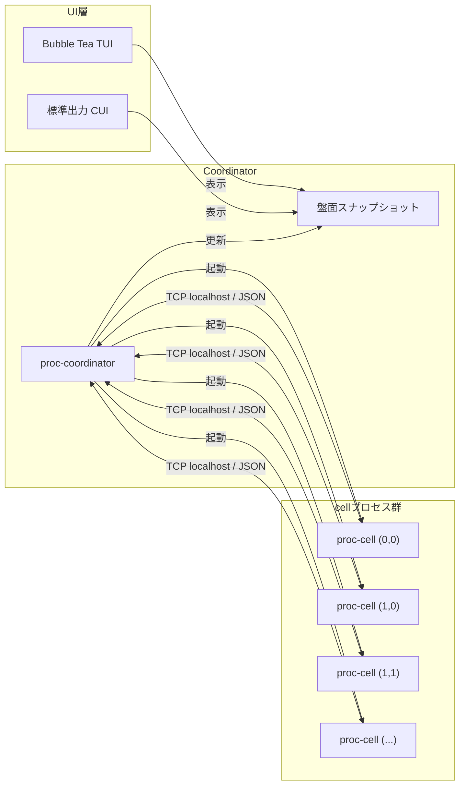

# システム構成

```mermaid
flowchart LR
    subgraph UI["UI層"]
        TUI["Bubble Tea TUI"]
        CUI["標準出力 CUI"]
    end

    subgraph Coordinator["Coordinator"]
        COORD["proc-coordinator"]
        SNAP["盤面スナップショット"]
    end

    subgraph Cells["cellプロセス群"]
        C00["proc-cell (0,0)"]
        C10["proc-cell (1,0)"]
        C11["proc-cell (1,1)"]
        CN["proc-cell (...)"]
    end

    TUI -->|表示| SNAP
    CUI -->|表示| SNAP
    COORD -->|更新| SNAP

    COORD -->|起動| C00
    COORD -->|起動| C10
    COORD -->|起動| C11
    COORD -->|起動| CN

    COORD <-->|TCP localhost / JSON| C00
    COORD <-->|TCP localhost / JSON| C10
    COORD <-->|TCP localhost / JSON| C11
    COORD <-->|TCP localhost / JSON| CN
```
