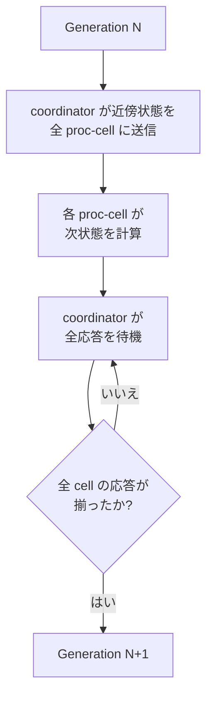

# バリア同期

```mermaid
flowchart TB
    G0["Generation N"]
    SEND["coordinator が近傍状態を\n全 proc-cell に送信"]
    CALC["各 proc-cell が\n次状態を計算"]
    WAIT["coordinator が\n全応答を待機"]
    BARRIER{"全 cell の応答が\n揃ったか?"}
    NEXT["Generation N+1"]

    G0 --> SEND
    SEND --> CALC
    CALC --> WAIT
    WAIT --> BARRIER
    BARRIER -->|いいえ| WAIT
    BARRIER -->|はい| NEXT
```
