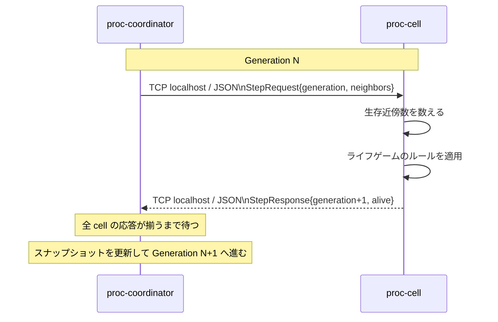

# プロセス間通信

```mermaid
sequenceDiagram
    participant Coord as proc-coordinator
    participant Cell as proc-cell

    Note over Coord,Cell: Generation N
    Coord->>Cell: TCP localhost / JSON\nStepRequest{generation, neighbors}
    Cell->>Cell: 生存近傍数を数える
    Cell->>Cell: ライフゲームのルールを適用
    Cell-->>Coord: TCP localhost / JSON\nStepResponse{generation+1, alive}
    Note over Coord: 全 cell の応答が揃うまで待つ
    Note over Coord: スナップショットを更新して Generation N+1 へ進む
```
