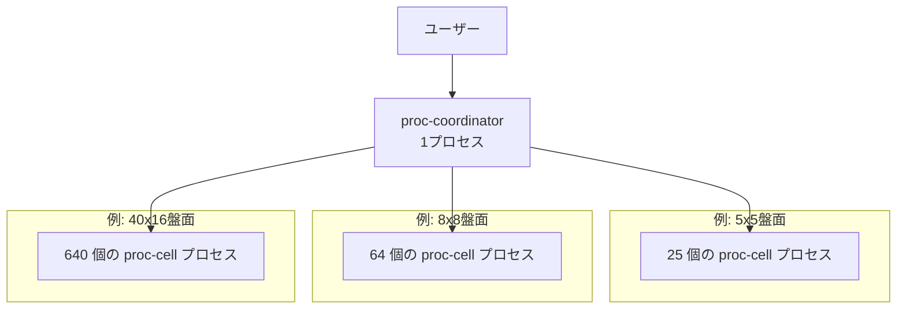

# プロセスモデル

```mermaid
flowchart TB
    USER["ユーザー"]
    COORD["proc-coordinator\n1プロセス"]

    subgraph Grid5x5["例: 5x5盤面"]
        P25["25 個の proc-cell プロセス"]
    end

    subgraph Grid8x8["例: 8x8盤面"]
        P64["64 個の proc-cell プロセス"]
    end

    subgraph Grid40x16["例: 40x16盤面"]
        P640["640 個の proc-cell プロセス"]
    end

    USER --> COORD
    COORD --> P25
    COORD --> P64
    COORD --> P640
```
